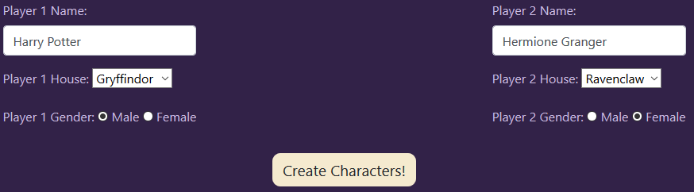
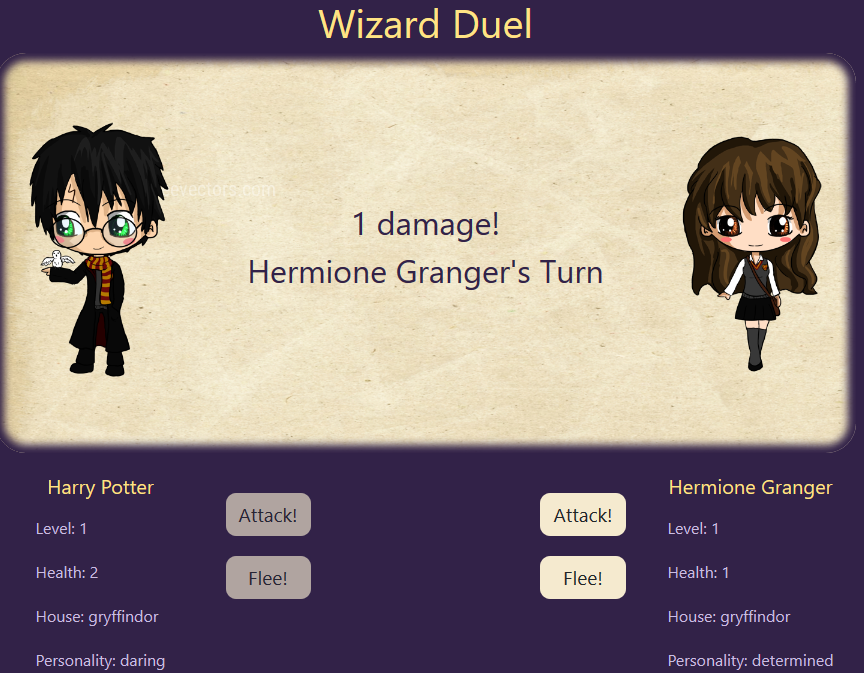

# _[Harry Potter RPG Duel with Functional Programming](https://github.com/TSiu88/harry-potter-rpg-functional)_

#### _Exercise in Refactoring Old Projects to Functional Programming, 04.15.2020_

#### By _**Tiffany Siu, Adela Darmansyah, Michael Bradt, and Sasa Schwartz**_

<!-- 

Made with [contributors-img](https://contributors-img.web.app). -->

---
## Table of Contents
1. [Description](#description)
2. [Setup/Installation Requirements](#setup/installation-requirements)
    - [Requirements to Run](#requirements-to-run)
    - [Instructions](#instructions)
    - [Other Technologies Used](#other-technologies-used)
3. [Notable Features](#notable-features)
4. [Specifications](#specifications)
5. [Screenshots](#screenshots)
6. [Test Case Example](#test-case-example)
7. [Known Bugs](#known-bugs)
8. [Support and Contact Details](#support-and-contact-details)
9. [License](#license)
---

## Description

This program is refactoring of a previously created dueling program between two players using functional programming techniques.  There is some randomization in how much damage is done and with each win the amount of damage and random traits received increases.  Game continues until someone gives up or out of health.

#### TO DO
- [ ] Fix name of DOM selector in main's function displayItems
- [ ] Write functionality to use an item
- [ ] Add different effects of different items
- [ ] Add functionality to remove an item after using one from inventory list and select list

## Setup/Installation Requirements

### Requirements to Run
* _Web Browser_
* _Webpack_
* _Node.js_
* _NPM_

### Instructions

*This page may be viewed by:*

1. Download and install Node.js from the [official website](https://nodejs.org/en/download/)
2. Clone the [repository](https://github.com/TSiu88/harry-potter-rpg-functional.git) from my [GitHub page](https://github.com/TSiu88)
3. Use a command line/Bash to move to the project directory with `cd into-project-directory`
4. Run `npm install` to get all dependencies. 
5. Run `npm run start` to start up the program

## Other Technologies Used

* _HTML_
* _CSS_
* _Javascript_
* _JQuery 3.4.1_
* _Bootstrap 4.4.1_
* _ESLint_
* _Babel_
* _Webpack_
* _Jest_
* _Markdown_

## Notable Features
<!-- _features that make project stand out_ -->

## Specifications

  
Click to expand to view Specifications

| Specification | Input | Output |
| :-------------     | :------------- | :------------- |
| The program displays start screen with ability to pick names, house, and gender | Application start | Start screen displayed |
| The program displays picture depending on gender, name, house, and personality randomly from list for house | Start game | Display player stats and button to start dueling |
| The players begin taking turns in attacking with chance to hit or miss, causing hp of defender to decrease by the attacker's level | Player 1 level = 1, Player 1 = spell hits | Player 2 = hp decreases by 1 |
| When player is lower leveled than the other, there is a random chance of doing one more damage point than normal | Player 1 level = 2, Player 2 level = 3 | Player 1 = has random chance of doing 0, 2, or 3 damage to Player 2 |
| When one player has less than or equal to 0 hp, the other player is declared the winner and levels up | Player 2 = 0 hp | Player 1 = winner, Player 1 level increased to 2 |
| If new level after leveling up is a multiple of 3, there's a chance of gaining a new personality trait | Player 1 leveled up to level 3 | Player 1 traits = "determined", Random trait that might add = "brave", so new Player 1's traits = ["determined", "brave"] |
| If new level after leveling up is a multiple of 3 and new random trait to try to add is the same as what the player already has, no new trait is added | Player 1 leveled up to level 3 | Player 1 traits = "determined", Random trait that might add = "determined", so new Player 1's traits unchanged and only = "determined" |
| If new level after leveling up is a multiple of 5, there's a chance of gaining a new inventory item | Player 1 leveled up to level 10 | Player 1 inventory = "feather", Random item that might add = "pepperup potion", so new Player 1's items = ["feather", "pepperup potion"] |
| If new level after leveling up is a multiple of 5, and new random item to try to add is the same as what the player already has, no new item is added | Player 1 leveled up to level 10 | Player 1 inventory = "feather", Random item that might add = "feather", so new Player 1's items unchanged and only = "feather" |

## Screenshots

_Here is a snippet of what the input looks like:_

_Here is a preview of what the output looks like:_

## Test Case Example
_Tests are done through Jest and are run from the command line prompt with `npm test`._

_Some example tests:_

## Known Bugs

_There are currently no known bugs in this program_

## Support and contact details

_If there are any question or concerns please contact  [Tiffany](mailto:tsiu88@gmail.com), [Adela](mailto:adela.yohana@gmail.com), or [Miles](smbradtmichael@gmail.com). Thank you._

### License

*This software is licensed under the MIT license*

Copyright (c) 2020 **_Tiffany Siu, Adela Darmansyah, Michael Bradt, Sasa Schwartz_**
